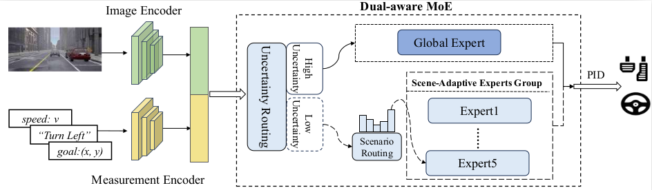

<div align="center">

### GEMINUS: Dual-aware Global and Scene-Adaptive Mixture-of-Experts for End-to-End Autonomous Driving

Chi Wan<sup>1</sup>, Yixin Cui<sup>1</sup>, Jiatong Du<sup>1</sup>, Shuo Yang<sup>1</sup>, Yulong Bai<sup>1</sup>, Yanjun Huang<sup>1†</sup>
<br>
<sup>1</sup> Institute of Intelligent Vehicles, Tongji University (TJU-IIV)
<br>
(†) Corresponding author.
<br><br>

<a href="https://www.arxiv.org/abs/2507.14456"></a>

</div>

## Abstract
End-to-end autonomous driving requires adaptive
and robust handling of complex and diverse traffic environments. However, prevalent single-mode planning methods
attempt to learn an overall policy while struggling to acquire
diversified driving skills to handle diverse scenarios. Therefore,
this paper proposes GEMINUS, a Mixture-of-Experts end-toend autonomous driving framework featuring a Global Expert,
a Scene-Adaptive Experts Group, and equipped with a Dualaware Router. Specifically, the Global Expert is trained on
the overall dataset, possessing robust performance. The SceneAdaptive Experts are trained on corresponding scene subsets, achieving adaptive performance. The Dual-aware Router
simultaneously considers scenario-level features and routing
uncertainty to dynamically activate expert modules. Through
the effective coupling of the Global Expert and the SceneAdaptive Experts Group via the Dual-aware Router, GEMINUS
achieves adaptive and robust performance in diverse scenarios.
GEMINUS outperforms existing methods in the Bench2Drive
closed-loop benchmark and achieves state-of-the-art performance in Driving Score and Success Rate, even with only
monocular vision input. Furthermore, ablation studies demonstrate significant improvements over the original single-expert
baseline: 7.67% in Driving Score, 22.06% in Success Rate, and
19.41% in MultiAbility-Mean.

## Overview
<div align="center">

</div>

## Release List
- [√] Getting Started
- [ ] Data Preprocessing
- [ ] Training
- [ ] Open-loop Evalution
- [ ] Close-loop Evalution

## Getting Started

Clone this repository and set up the required environment by running the commands below.

```bash
# Step 1: Clone the Repository
git clone [https://github.com/newbrains1/GEMINUS.git](https://github.com/newbrains1/GEMINUS.git)
cd GEMINUS

# Step 2: Create Conda Environment & Activate
conda env create -f environment.yml
conda activate geminus

# Step 3: Install PyTorch
pip install torch==2.4.1 torchvision==0.19.1 torchaudio==2.4.1 --index-url [https://download.pytorch.org/whl/cu118](https://download.pytorch.org/whl/cu118)
```

## Data Preprocessing
### 1. Download the Dataset
Please download the **Bench2Drive-base** dataset (approx. 400GB) and extract it to your desired location. You can get the data from [**Hugging Face**](https://huggingface.co/datasets/rethinklab/Bench2Drive) or [**Baidu Cloud**](https://pan.baidu.com/s/1ZIL-MPhLbgdBYmHkHncn8Q) (Password: `1234`).

### 2. Process the Data


## Citation
If you find our repo or our paper useful, please use the following citation:
```bibtex
@article{wan2025geminus,
  title={GEMINUS: Dual-aware Global and Scene-Adaptive Mixture-of-Experts for End-to-End Autonomous Driving},
  author={Wan, Chi and Cui, Yixin and Du, Jiatong and Yang, Shuo and Bai, Yulong and Huang, Yanjun},
  journal={arXiv preprint arXiv:2507.14456},
  year={2025}
}
```

## Acknowledgements
Our code is based on several repositories:
- [Bench2Drive](https://github.com/Thinklab-SJTU/Bench2Drive)
- [Bench2Drive-Zoo](https://github.com/Thinklab-SJTU/Bench2DriveZoo/tree/tcp/admlp)
- [TCP](https://github.com/OpenDriveLab/TCP)
